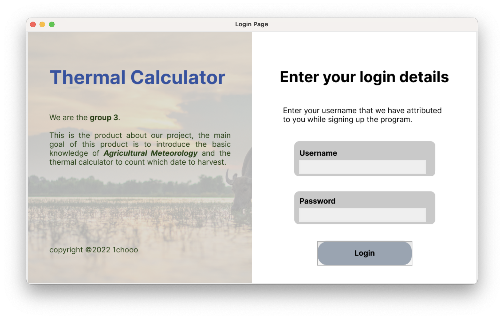

# Tkinter-gui

### Topic: Find Root

### Numerical Method: The Newton-Raphson Method

### Member

| Name | Student Number | Divide and Conquer       |
|------|----------------|--------------------------|
| 林群賀  | 109601003      | Data   Scratch           |
| 洪晨哲  | 109601002      | Main Function            |
| 孫維辰  | 109601517      | GUI and Data pre-solving |

### Motivation

農作物種植是我們國家重要的糧食與經濟來源，其中又以稻米為重中之重，
若能增快種植到收成的時間，更是重要的一件事。而我們就好奇在台灣，
有沒有方法能更加精確的找到實際成熟日期，而非單純利用經驗來得知能夠收成的日子呢？

最終我們找到了積溫，一種屬於農作物本身，只要每日有效溫度累積滿就會熟成的數值，
故我們以此為發想，做出可以計算收成時間的積溫計算機。


### Python Environment

``` shell
❯ $ python3 --version 
Python 3.10.1

❯ $ pip3 install requests
❯ $ pip3 install tk
❯ $ pip3 install numpy
❯ $ pip3 install matplotlib
```

### How to use this? (clone with ssh)

``` shell
❯ $ git clone git@github.com:1chooo/Tkinter-gui.git
❯ $ cd Tkinter-gui
❯ $ python3 main.py
```

### Demo

#### The login page


#### The Dashboard page


#### The Guide page


#### The Background page


#### The Calculator page


#### The About us page


### Reference

* 農業與積溫計算相關:
  * https://scholars.tari.gov.tw/bitstream/123456789/14023/1/63-1-3.pdf
  * https://www.mdais.gov.tw/files/mdais/web_structure/2291/517.pdf
  * https://www.hdares.gov.tw/upload/hdares/files/web_structure/606/10.pdf
  * https://agr.cwb.gov.tw/NAGR/history/station_day
  * https://en.wikipedia.org/wiki/Growing_degree-day
  * https://www.guayunfan.com/lsgs/28626.html
* Button
  * [Python tkinter Button 按鈕用法與範例](https://shengyu7697.github.io/python-tkinter-button/)
  * [Button 按鈕](https://steam.oxxostudio.tw/category/python/tkinter/button.html)
  * [Tkinter 教程 - 佈局管理](https://www.delftstack.com/zh-tw/tutorial/tkinter-tutorial/tkinter-geometry-managers/)
  * [Tkinter Button](https://www.pythontutorial.net/tkinter/tkinter-button/)
* Image
  * [Tkinter PhotoImage](https://www.pythontutorial.net/tkinter/tkinter-photoimage/)
  * [Python之解决tkinter.PhotoImage不显示图片的问题 Python3](https://blog.csdn.net/m0_50000839/article/details/120078530)
* Place 
  * [善用tkinter的布局方法（pack､place､grid）,讓您輕鬆規劃部件的位置及樣貌](https://pythonhi.pixnet.net/blog/post/322521486)
* Canvas
  * [Canvas 畫布](https://steam.oxxostudio.tw/category/python/tkinter/canvas.html)
  * [Python Tkinter 画布（Canvas）](https://www.runoob.com/python/python-tk-canvas.html)
  * [Photoimage 顯示圖片](https://steam.oxxostudio.tw/category/python/tkinter/photoimage.html)
* Cursors
  * [Tkinter 8.5 reference: a GUI for Python](https://anzeljg.github.io/rin2/book2/2405/docs/tkinter/cursors.html)
* Entry
  * [Python tkinter Entry 文字輸入框用法與範例](https://shengyu7697.github.io/python-tkinter-entry/)
  * [Managing background colour of Tkinter Entry based on number of chars entered by user using config()
](https://www.youtube.com/watch?v=KV3SPTt1WWs)
* Menu
  * [Tkinter Menu](https://www.pythontutorial.net/tkinter/tkinter-menu/)